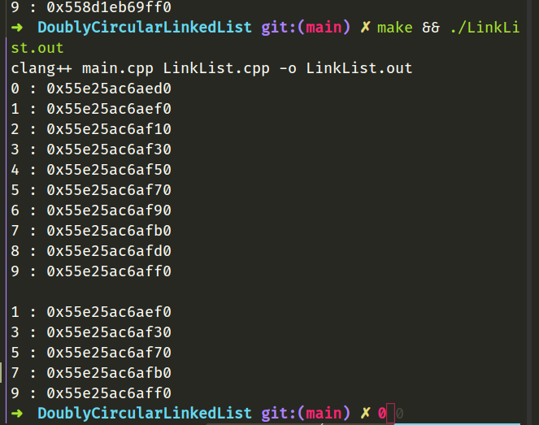
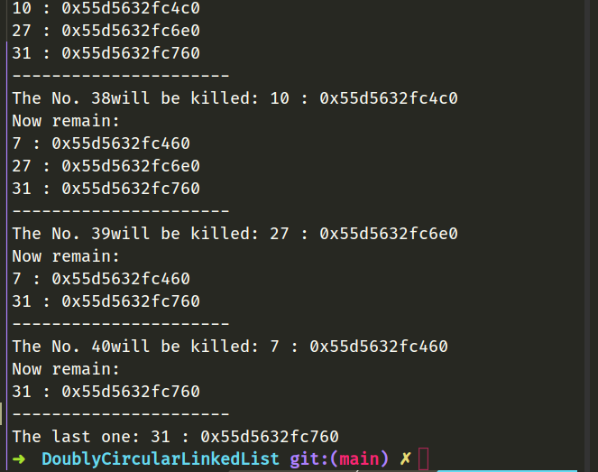
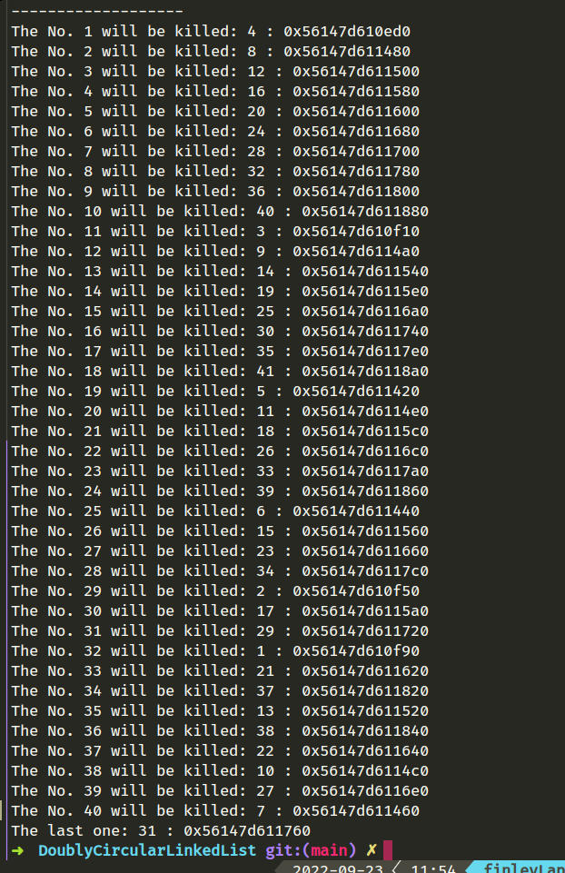

# Test Report 测试报告
## 基础测试 
插入删除
```cpp
  LinkList l;
  for (int i = 0; i < 10; i++)
    l.pushBack(i);
  l.show();
  // remove the odds
  for (int i = 0; i < 10; i += 2) {
    l.erease(i);
  }
  cout << endl;
  l.show();
  return 0;
```


插入了0~9, 删除所有偶数.

## 约瑟夫问题求解

最后结果:



完整输出:


