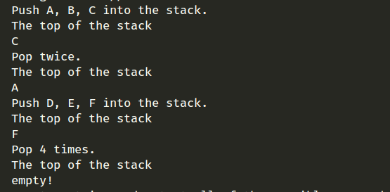
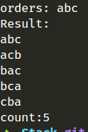
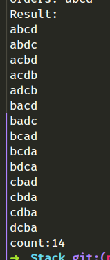
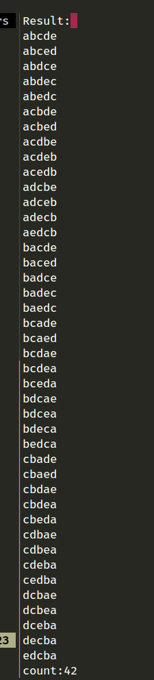

# 栈的实现和应用

## 基础测试

实现字符 'A'，'B'，'C'的入栈

输出栈顶元素，应该输出 'C'

执行两次出栈操作，输出栈顶元素，应该输出 'A'

再实现'D'，'E'，'F'的入栈，输出栈顶元素，应该输出 'F'

再执行4次出栈操作，再输出栈顶元素，应该会提示，”此时为空栈“

### 测试结果

## 测试输出所有出栈结果

### 3个 abc

### 4个 abc

### 5个 abcde

