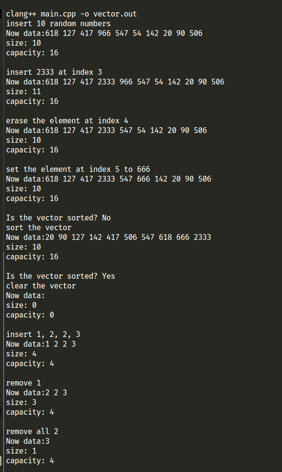

# 测试报告

## 编译 & 测试环境
我的环境是`Ubuntu 22.04 LTS, kernel 5.15.0`

使用的编译器是`clang++`

文件中附带了`makefile` 请根据内容修改编译器.

## 基本功能curd
- 增加(pushBack, insert)
- 删除(popBack, erase)
- 修改(修改某一个特定值)
- 查询(打印)

测试代码:

```cpp
void print(string msg) {
  cout << msg << endl;
  for (int i = 0; i < v.size(); i++) {
    cout << v[i] << " ";
  }
  cout << endl;
  cout << "size: " << v.size() << endl;
  cout << "capacity: " << v.capacity() << endl;
}

int main() {
  srand(time(NULL));
  for (int i = 0; i < 10; i++) {
    v.pushBack(rand() % 1000);
  }
  print("insert 10 random numbers");

  v.insert(3, 2333);
  print("insert 2333 at index 3");

  v.erase(4);
  print("erase the element at index 4");
  v[5] = 666;

  print("set the element at index 5 to 666");
  cout << "Is the vector sorted? " << (v.isSorted() ? "Yes" : "No") << endl;

  v.sort();
  print("sort the vector");
  cout << "Is the vector sorted? " << (v.isSorted() ? "Yes" : "No") << endl;
  return 0;
}
```

## 输出截图


## 其他功能
- 排序 直接调用 STL 的 sort 函数
- 是否有序

# 基本思路

1. 内存管理

默认开的是0空间. 
在插入时检查, 如果size == capacity

直接double capacity, 并且"移动"(复制)原来的数据到新的空间.

2. 数据连续性

popBack, pushBack不需要考虑数据连续性,
而insert, erase需要考虑数据连续性问题.

insert, erase时实际上开辟了新的空间, 释放了旧的空间.

3. 数据访问和修改
实现了一个`reference`类, 实际上是对指针的封装.
包括但不限于下列好处:

    1. 防止对指针的错误操作, 导致指针被释放或其他不可预期的问题.
    2. 能重构`=`, `<<` 运算符, 操作更加人性化(直接返回指针, 需要*v[0]获取值)


# 关于进一步优化的思考
1. 移动数据造成的运算开销

是否存在更优化的解决方法, 进行$O(1)$复杂度的数据迁移?

是否能将`vector` 和 `linked list`结合起来
(使用指针保证数据链接, 不保证数据的连续性, 代价是查询开销增大)

2. 内存开销的优化

按照本算法, 内存开销的增长率是巨大的($O(2^n)$), 是否存在优化空间.

(STL中的vector提供了`shrink_to_fit`的方法允许手动释放没用的内存, 是否存在自动释放内存的方式?)
